# BFLFP CMMS — Canonical Architecture & End-to-End Flow (APPROVED)
Status: approved baseline — further changes will be announced during build (owner: Madhan).
This document supersedes conflicting statements elsewhere; DATA-AND-FLOW-SPEC.md and
SYSTEM-BLUEPRINT.md remain as detail references.

## Build delta checklist (refinements in this architecture vs current code)

| # | Refinement | Status in code |
|---|---|---|
| 1 | KPI class requires APPROVED classification — ideal rate alone must not make a machine OEE | ◐ v2.0.0 columns (kpi_class + kpi_approved); enforcement in KPI engine + admin UI pending |
| 2 | CM `production_impact` field (No impact / Reduced speed / Quality impact / Machine stopped) — only "stopped" counts as downtime | ◐ v2.0.0 field + API; UI selector + downtime logic pending |
| 3 | Two separated measures: Technical MTTR (work segments) vs Restoration time (done_at − created_at) — never mixed | ◐ engine computes both; expose both explicitly |
| 4 | Performance capped at 100% for reporting; uncapped values flagged for master-data review | ◐ capped; add the flag/report |
| 5 | PM compliance denominator must include overdue OPEN PMs | ✅ v2.0.0 |
| 6 | Extra segment types: Travel, External support | ☐ add seg_type + Gantt colors |
| 7 | BD routing: factory + line + criticality + duty roster → eligible team; planner override for critical | ☐ v1.1 (needs factories + roster) |
| 8 | PM finds abnormal condition → create linked corrective job | ☐ to build (link pattern like re-issue) |
| 9 | Inspection verdict "new issue found" → linked follow-up work order | ☐ to build |
| 10 | Technician explicit ACCEPT step (records response time on all jobs) | ☐ to build |
| 11 | Stock balance derived from part_moves — transactions are the source of truth, cached balance ok | ☐ inventory module (design confirmed) |
| 12 | Report storage path: Factory / Year / Month / Date | ☐ with factories module |
| 13 | "Inspection Finds Issue" as first-class work source | ☐ jobsource value + UI |
| 14 | **Offline-first mobile** — no-signal areas (retort room, basement): actions queue locally on the phone (IndexedDB), auto-sync with retry/backoff when connection returns; my-jobs readable offline; timestamps captured at button-press time, not sync time | ☐ mobile UI phase — priority requirement |

Legend: ☐ to build · ◐ partial · ✅ done. Update this table every release.

Closing rule from the architect: **data integrity is the product** — OEE classification,
ideal rates, production units, breakdown start/end rules and time-segment definitions
must be locked down, or the system produces professional-looking dashboards with
incorrect numbers.

---

## Complete End-to-End System Flow

```mermaid
flowchart TD
    A[Admin Setup] --> A1[Create Factories]
    A1 --> A2[Import Machines / Assets]
    A2 --> A3[Assign KPI Class]
    A3 --> A4[Create Users and Roles]
    A4 --> A5[Configure PM Frequency, Targets and Form Codes]
    A3 --> K1{Machine KPI Class}
    K1 -->|OEE| K2[Production Machine]
    K1 -->|BATCH| K3[Batch / Cycle Machine]
    K1 -->|AVAIL| K4[Utility / Support / Vehicle]
    K2 --> S1[Shift Production Entry Required]
    K3 --> S2[Batch / Cycle Entry Required]
    K4 --> S3[No Production Entry Required]
    A5 --> B{Work Source}
    B -->|Operator QR Report| C1[Corrective / Breakdown Request]
    B -->|Automatic PM Due| C2[PM Work Order]
    B -->|Planner Creates| C3[Improvement / Planned Work]
    B -->|Inspection Finds Issue| C4[Follow-up Work Order]
    C1 --> D1{Breakdown?}
    D1 -->|Yes| D2[Create BD Job]
    D1 -->|No| D3[Create CM Job]
    D2 --> D4[Status: Reported]
    D3 --> D4
    C2 --> D5[Status: Waiting Approval / Planned]
    C3 --> D5
    C4 --> D5
    D4 --> E1[Notify Planner]
    D4 --> E2[Push All Qualified On-duty Technicians]
    D5 --> E1
    E1 --> F1[Planner Reviews Request]
    F1 --> F2{Approve?}
    F2 -->|Reject| F3[Rejected + Reason]
    F2 -->|Approve| F4[Set Priority, Crew, Dates and Due Date]
    F4 --> F5[Assign Lead Technician and Helpers]
    F5 --> F6[Status: Assigned]
    F6 --> F7[Planner Releases Job]
    F7 --> F8[Status: Released]
    E2 --> G1[First Technician Accepts Breakdown]
    G1 --> G2[Record Response Time]
    G2 --> F8
    F8 --> H1[Technician Opens Job]
    H1 --> H2[Review Problem, Safety and Instructions]
    H2 --> H3[Start Timer]
    H3 --> H4[Status: In Progress]
    H4 --> I1{Continue Working?}
    I1 -->|Work| I2[Work Segment]
    I1 -->|Pause| I3[Select Pause Reason]
    I3 --> I4[Waiting Parts / Production / Approval / Standby]
    I4 --> I5[Close Current Time Segment]
    I5 --> I6[Status: Paused]
    I6 --> H3
    I2 --> J1[Diagnose Problem]
    J1 --> J2[Enter Fault Category and Component]
    J2 --> J3[Enter Root Cause]
    J3 --> J4[Enter Maintenance Action and Solution]
    J4 --> P1{Parts Used?}
    P1 -->|Yes| P2[Select Part and Quantity]
    P2 --> P3[Create Part Move]
    P3 --> P4[Reduce Stock]
    P4 --> P5{Below Minimum Stock?}
    P5 -->|Yes| P6[Notify Planner + Create Requisition Queue]
    P5 -->|No| J5
    P6 --> J5
    P1 -->|No| J5
    J5[Upload Before / After Photos] --> J6[Confirm Worksite Cleared]
    J6 --> J7[Requester / Inspector Signature]
    J7 --> J8[Technician Finishes Work]
    J8 --> J9[Status: Service Completed]
    J9 --> L1[Planner Inspects Job]
    L1 --> L2{Work Accepted?}
    L2 -->|No| L3[Enter Rework Reason]
    L3 --> L4[Increase Rework Count]
    L4 --> L5[Status: Rework]
    L5 --> F5
    L2 -->|Yes| L6{New Issue Found?}
    L6 -->|Yes| L7[Create Linked Follow-up Work Order]
    L6 -->|No| L8[Close Job]
    L7 --> L8
    L8 --> L9[Status: Done]
    L9 --> M1[Stop Breakdown Downtime]
    M1 --> M2[Generate Repair PDF]
    M2 --> M3[Update Machine History]
    M3 --> M4[Update KPI Dataset]
    M4 --> M5[Archive Evidence and Audit Trail]
```

## 1. Master-Data Setup Flow

Admin: Create factory → configure factory document code + KPI targets → import
machine register → assign factory, line, area, criticality → classify each asset
OEE / BATCH / AVAIL → set ideal rate or standard cycle time where applicable →
configure PM frequency + checklist → create users with plant + role → system ready.

Machine-import classification:

| Register classification | System KPI class |
|---|---|
| Filler, seamer, labeler, packing machine | OEE |
| Mixer, retort, cooker | BATCH |
| Compressor, HVAC, chiller, boiler, pump | AVAIL |
| Electrical, IT and support assets | AVAIL |
| Vehicle | AVAIL with odometer |
| Unmapped asset | AVAIL by default |

An asset must NOT become OEE merely because an admin enters an ideal rate — it
also requires an approved production-machine classification.

## 2. Breakdown Work-Order Flow

QR scan → machine loads → symptom/priority/photo → BD created (created_at =
downtime start) → notify planner + push all qualified on-duty technicians →
first technician ACCEPTS (response-time endpoint) → repair with segments →
Service Completed → planner inspects → Done (downtime endpoint) / Rework.

Routing: machine factory + line/area + criticality + technician duty roster →
eligible team. Planner can override and add specialists for critical breakdowns.

## 3. Corrective-Maintenance Flow

Reported → planner reviews urgency/impact → approve → planned date, due date,
crew → Assigned → Released → execute → Service Completed → verify → Done/Rework.

CM must carry `production_impact`: No impact / Reduced speed / Quality impact /
Machine stopped. CM only counts as downtime when the machine is actually
unavailable — otherwise downtime and MTBF become unreliable.

## 4. Preventive-Maintenance Flow

Frequency elapses → generate PM WO + attach checklist → planner selects window,
assigns crew, releases → technician completes checklist, records measurements
and condition → abnormal condition found? → create LINKED corrective job →
upload evidence → Service Completed → planner verifies → Done → update last PM
date → calculate next PM date → update PM compliance.

PM compliance = PM completed on-or-before due ÷ total PM due in period.
Overdue OPEN PMs stay in the denominator.

## 5. Technician Execution and Time Segments

One open segment per technician (enforced). Segment types: Work, Waiting
(parts), Standby (machine release), Meeting, Routine, Travel, External support.

Two measures, never mixed:
- Technical repair time = Σ work segments
- Total restoration duration = BD Done time − BD Created time

## 6. Spare-Part Flow

Part used → validate stock → enough: negative part_move → update balance →
link cost to work order → below minimum? → low-stock alert + requisition queue.
Not enough: shortage flag → requisition → planner approves → Ordered →
Received → positive part_move.

Stock balance is DERIVED from part_moves (transaction history = source of
truth); cached balance for speed only.

## 7. Production and Shift-Log Flow

Only OEE and BATCH machines request production entry.

- OEE: planned_min, output, good → reject auto; BD downtime read automatically;
  A = run/planned, P = output/(ideal rate × run) — capped at 100% for reporting,
  uncapped flagged for master-data review; Q = good/output; OEE = A×P×Q
- BATCH: planned_min, cycles, good cycles; P = (cycles × std cycle time)/run;
  Q = good cycles/cycles
- AVAIL (aircon, compressor, chiller, boiler, pump, electrical, IT, vehicle):
  no production entry; uptime, failure count, MTBF, MTTR, PM compliance from
  BD jobs automatically

## 8. Closure and Evidence Flow

Problem → fault category → fault component → root cause → maintenance action →
solution → parts usage → before/after photos where required → worksite-cleared
confirmation → requester/inspector signature → Service Completed.
Planner verdict: Accept (Done, done_at, downtime stopped, PDF, history, KPIs,
audit) or Rework (count +1, reason mandatory, reassign, new segments).
New issue found at inspection → linked follow-up work order.

## 9. KPI Processing

Inputs: Jobs, Timelogs, Shift Logs, Machine Master, Part Moves → KPI Engine →
MTTR, MTBF, Response Time, PM Compliance, Planned-vs-Reactive, FTFR, Backlog
Age, Availability, OEE/Batch OEE, Maintenance Cost → Dashboards and Reports.

| KPI | Main source |
|---|---|
| Response time | first technician start − job creation |
| Technical MTTR | work segments on breakdown jobs |
| Restoration time | breakdown Done − Created |
| MTBF | operating time ÷ breakdown count |
| PM compliance | PM due and completion dates (open overdue included) |
| Planned vs reactive | PM/CM/IMP work minutes vs total |
| FTFR | closed without rework or linked repeat issue |
| Backlog age | current date − created date |
| Availability | planned time − downtime |
| OEE | shift production + downtime + ideal rate |
| Maintenance cost | part moves + optional labour cost |

## 10. Reports and Automatic Triggers

Done → repair PDF → store under Factory/Year/Month/Date → machine history →
KPI refresh. Reports: repair form, daily report, evening Gantt (live),
monthly PM compliance, OEE report (weekly/monthly), machine history,
audit evidence pack, spare-part consumption, requisition status (live).

## 11. Role-by-Role Operating Flow

- Operator: scan QR → report → shift production → track own → confirm result → sign/evaluate
- Technician: receive → ACCEPT → start timer → diagnose → pause w/ reason → parts → root cause + solution → evidence → Service Completed
- Planner: review → approve/reject → prioritize → crew → window → release → monitor backlog → inspect → requisitions → close/rework
- Manager: dashboards → KPIs/trends → critical downtime → PM compliance → cost → reports
- Admin: factories → assets + KPI classes → users/roles → targets → forms/rules

## 12. Single-Line Business Flow

ADMIN SETUP → ASSET CLASSIFICATION → REPORT / AUTO PM → PLANNER APPROVAL →
CREW ASSIGNMENT → RELEASE → TECHNICIAN ACCEPTANCE → TIME SEGMENTS → DIAGNOSIS →
ROOT CAUSE → REPAIR → PARTS → EVIDENCE → SERVICE COMPLETED → INSPECTION →
REWORK OR DONE → DOWNTIME/COST/HISTORY → KPI → PDF AND MANAGEMENT REPORTS
